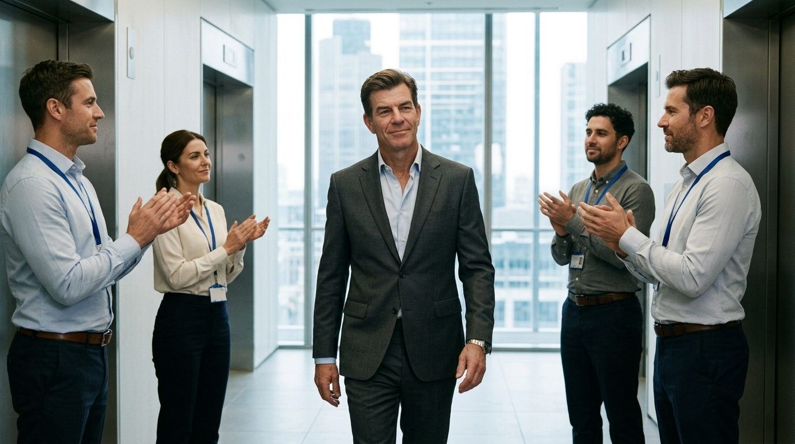

**Scene:** JUDGE movement (slides 1–9), beat two. Lift lobby of the glass tower:
colleagues applauding Tarquin as he crosses toward the lifts, a small ovation for
a deal nobody in frame understands. City Tarquin reads exactly as the anchor look
— navy suit, dark overcoat, mid-40s, groomed — and he accepts the applause as his
due, not as a surprise. What must read on screen: the adoration is real, and his
answer to it is smug enough that we are already on the other side of the joke.

**Prompt** (generated with the `@Tarquin` Flow Character cast, project `camping-v2`):
> Hyper-realistic documentary photograph, shot on 35mm film with fine natural grain, muted cool-neutral palette, naturalistic motivated lighting, no lens flares, calm observational tone, landscape orientation. The lift lobby of a glass office tower in London, cool daylight from a window wall behind, brushed-steel lift doors on both sides, wall sconces. He walks toward the camera in the centre of the lobby, caught mid-stride on his way to the lifts, wearing the same well-cut charcoal suit over an open-collar pale blue shirt, no tie, understated expensive watch; dark hair greying at the temples slicked straight back, well-fed face with a slight sheen. Four colleagues with lanyards stand either side applauding him warmly — a small office ovation — and he accepts it as his due: the faintest smug smile, chin slightly up, not surprised, not grateful. Camera at chest height, slightly off-axis, like a documentary crew caught the moment; city towers soft-focus through the window behind.

Superseded golden (wrong face, v2): https://storage.googleapis.com/badcode-storage/comics-v2/camping-jack-test/img/i41.png

**Bubbles:**
1. S "Tarquin, you've done it again. How do you do it?" — x 54.10 · y 72.77 · type S · tail none · appearAt [0, 0.5]
2. S "Easy. You just have to have a Winning Mentality™." — x 50.48 · y 21.76 · type S · tail bottom · appearAt [0.45, 1]

**Page:** hold 1.8 · transition: default (not overridden in §3) · effect: none.

**Revisions:**
- v0 (2026-07-25) — recut spec
- v2 (2026-07-25) — REGENERATED for face continuity, same reason and reference as p02. New key img/i41.png.
- v3 (2026-07-27) — REGENERATED with the `@Tarquin` Flow Character cast, same reason as p02 v3. 2 candidates; accepted b (pale-blue open-collar shirt + charcoal suit matches accepted p02 wardrobe; candidate a's cream shirt would flicker between adjacent slides). New key img/i45.png.
