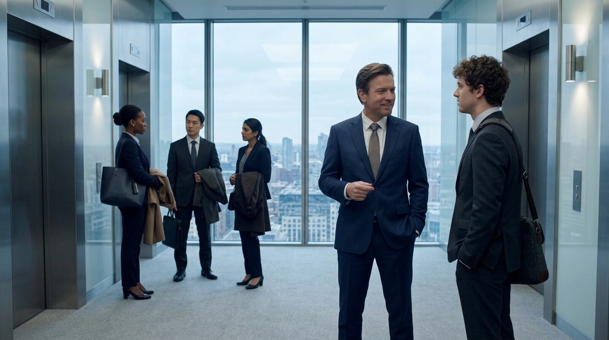

**Scene:** JUDGE movement (slides 1–9). Office lobby, end of the week: Tarquin
and a colleague trading small talk on the way out, city-Tarquin in his navy
suit, groomed, entirely at ease. The exchange sets up the whole trip — the
retreat, the £400-a-night distinction, and the colleague's awe — so the four
speech bubbles must stagger cleanly left/right across the frame and stay
legible over the lobby's cool interior light. The final thought bubble
("He is so cool…") lands last, top-right, as the punchline of the beat.

**Prompt** (generated with the `@Tarquin` Flow Character cast, project `camping-v2`):
> Hyper-realistic documentary photograph, shot on 35mm film with fine natural grain, muted cool-neutral palette, naturalistic motivated lighting, no lens flares, calm observational tone, landscape orientation. The ground-floor lobby of a glass office tower in London at the end of the working week, cool interior light, early evening blue through the glass frontage, security gates and a reception desk soft-focus in the background. Two men pause mid-conversation on their way out. On the right of frame: he stands relaxed and entirely at ease, wearing a well-cut charcoal suit over an open-collar pale blue shirt, no tie, understated expensive watch, dark hair greying at the temples slicked straight back, well-fed face with a slight sheen, a faint self-satisfied smile as he name-drops his weekend plans. On the left of frame: a younger colleague in an off-the-peg grey suit with a lanyard, laptop bag over his shoulder, looking at the older man with open admiration. Comfortable space between them for the exchange to breathe; camera at chest height, slightly wide, observational.

Superseded golden (wrong face, v2): https://storage.googleapis.com/badcode-storage/comics-v2/camping-jack-test/img/i42.png

**Bubbles:**

1. S "What are you up to this weekend, mate?" — x 18.48 · y 55.44 · type S ·
   tail none · appearAt [0, 0.45]
2. S "An ayahuasca retreat in Wales. I'm curious about myself." — x 60 ·
   y 22 · type S · tail none · appearAt [0.4, 1]

**Page:** hold 1.6 · transition: default · effect: none

**Revisions:**
- v0 (2026-07-25) — recut spec
- v4 (2026-07-28) — CUT to two bubbles (Kai review): five bubbles was too many and
  the beat scrolled too long. Dropped the camping/glamping exchange and the
  "He is so cool…" thought; the answer now names the ayahuasca retreat directly.
  hold 2.8 → 1.6.
- v2 (2026-07-25) — REGENERATED for face continuity, same reason and reference as p02. New key img/i42.png.
- v3 (2026-07-27) — REGENERATED with the `@Tarquin` Flow Character cast, same reason as p02 v3. 2 candidates; accepted a (clean left/right separation — colleague left at turnstiles, Tarquin right — leaving the centre gap and top-right clear for the five bubbles). Bubble positions may still need a TUNE pass against the new composition. New key img/i46.png.
