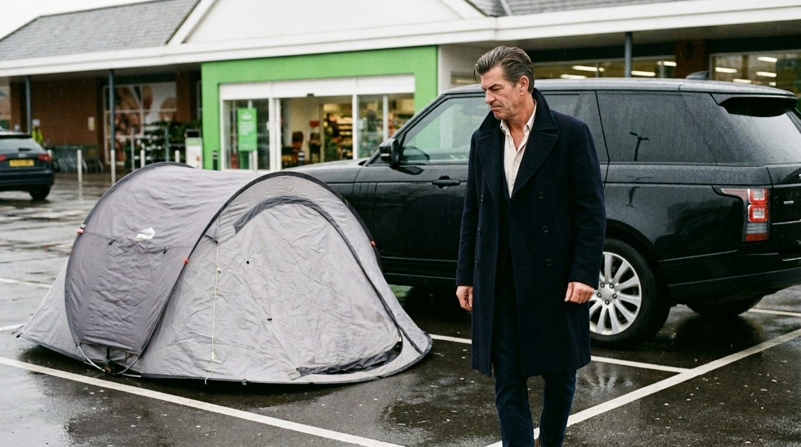

**Scene:** Movement **JUDGE (slides 1–9)**, the beat where Tarquin's contempt
becomes visible in the world rather than just in his head. Ground level in the
Waitrose car park, straight after the aerial of the X7 pulling in (slide 6):
Tarquin caught mid-stride beside his car, sneering down and camera-left at
Bob's battered grey dome tent pitched on the tarmac. Behind him the X7
straddles **two marked parking bays** — the white lines must be legible under
its wheels, because this is the setup for slide 20's "Took two spaces" — with
the plate reading `T4RQ 1N`.

What must read on screen: the two straddled bays, the plate, the tent, and the
sneer. Tarquin is still **city Tarquin** here (navy overcoat, mid-40s, groomed,
per `i03`/`i04`) — the visual opposite of the man he becomes in slide 23.

**Prompt** (generated with the `@Tarquin` Flow Character cast, project `camping-v2`; base generation `f0d24d5d-df48-4a6e-a06c-22699bc44f5d`, then one `flow_edit_image` pass to strip the fascia lettering):
> Hyper-realistic documentary photograph, shot on 35mm film with fine natural grain, muted cool-neutral palette, naturalistic motivated lighting, no lens flares, calm observational tone, landscape orientation; late-70s scanned film negative feel, subtle dust specks, vintage lens softness. A supermarket car park in Britain under overcast drizzle, wet tarmac reflections. Ground-level medium shot: he stands mid-stride beside a large black luxury SUV, wearing a heavy dark navy overcoat over an open-collar pale shirt, dark hair greying at the temples slicked straight back, well-fed face; his lip is curled in contempt as he looks down and to camera-left at a battered grey dome tent pitched in a parking bay on the tarmac, guy ropes pegged into cracks. Behind him the SUV is parked at an angle across two marked parking bays, the white bay lines clearly visible under its wheels. In the far background an upmarket supermarket fascia in green and white, lettering indistinct and out of focus. His face around the upper right third of frame, the tent lower left; muted cold palette, natural grey daylight.

Sign-strip edit prompt (`flow_edit_image`, reference = the base generation):
> Using the provided image, change only the green supermarket lettering on the white storefront gable: remove the lettering completely, leaving a clean plain white gable with no text or logo at all. Keep everything else in the image exactly the same, preserving the original style, lighting, composition, the man, the car, and the tent.

Superseded golden (wrong face, tent missing, v2): https://storage.googleapis.com/badcode-storage/comics-v2/camping-jack-test/img/i43.png

**Bubbles:**

1. T (thought), tail `none` — "Two parking spaces. For that."
   - x `30.00` · y `25.00` · appearAt `[0, 0.45]` — **TUNE** (§5 NEW)
2. T (thought), tail `none` — "Get a job, you piece of—"
   - x `32.00` · y `40.00` · appearAt `[0.5, 0.9]` — **TUNE** (§5 NEW)

**Page:** hold 2.0 · transition — default · effect — `zoom({ amount: 1.25, focal: [0.55, 0.3] })`
(added in review: the push ends the page on his face rather than on the car, easing the
marque mismatch with slide 8 and adding motion to an otherwise static beat)

**Revisions:**
- v0 (2026-07-25) — recut spec
- v0.1 (2026-07-25) — hold pinned to 2.0 in spec §3 (was unspecified)
- v1 (2026-07-25) — generated (2 candidates, face-ref i04); accepted candidate a: contempt reads at scale, battered tent matches Bob's, plate T4RQ IN, X7 angled across the bay line. Candidate b rejected: clearer bay lines but Tarquin too small for the sneer to land.
- v2 (2026-07-25) — REGENERATED so Tarquin matches the city panels and his future self. KNOWN DEVIATIONS, accepted deliberately: (a) the car reads as a large black luxury saloon rather than the SUV of slides 5/6/8/16 — Bob's "big black thing, took two spaces" still holds; (b) the tent is out of frame, his eyeline carrying off-frame left into slide 8. Both were forced: every prompt placing the tent beside the expensive car was POLICY-BLOCKED by Flow (4 attempts, 2 phrasings), as was an edit swapping the car (the reference image carries real shop signage). Face continuity was judged more load-bearing than vehicle continuity. New key img/i43.png.
- v3 (2026-07-27) — REGENERATED with the `@Tarquin` Flow Character cast. Both v2 deviations RESOLVED: the tent is back in frame beside the car (the tent+luxury-car composition passes the usage filter once the brand triggers — marque, plate text, legible fascia — are stripped from the prompt), and the car reads as a large black SUV straddling two marked bays again. The base generation rendered a legible real supermarket wordmark despite "lettering indistinct"; one reference-anchored edit removed the lettering entirely (plain white gable — also the safer publication call). Plate is not legible; T4RQ 1N is given up in this shot. Sneer, tent, bay lines and face all read. New key img/i47.png.
