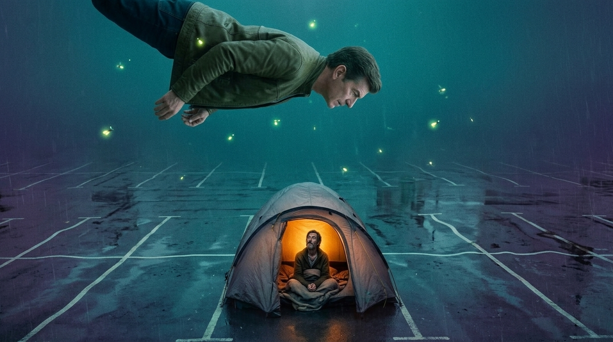

**Scene:** THE VISION — the hinge of the SEE movement (slides 10–15) and the
image the whole recut turns on. Tarquin, deep in the ayahuasca trip, floats
horizontally above a rain-soaked supermarket car park seen from high overhead,
looking down. Far below, one battered grey dome tent glows warm amber — and the
man sitting in its doorway, looking straight back up at him, is himself.
The composition must read as a vertical mirror: two versions of the same face
facing each other across the fall, with the tent as the only warm light in an
otherwise teal-and-violet void. This is where "three grand to meet myself this
weekend" pays off literally. Page runs `trip()` with hold 3.2 — the longest hold
in the movement — so the mirror has time to land before the narration closes it
with the trip's exit incantation.

**Prompt (planned, for the image lane):**
> Psychedelic vision, cinematic film still, 35mm. A man in an olive field
> jacket floats horizontally in a deep teal-and-violet void, seen slightly from
> above, looking down. Far below him, a rain-soaked supermarket car park seen
> from high overhead, its edges bending and rippling like a reflection in
> water; drifting bioluminescent fireflies. In the car park, one battered grey
> dome tent glows warm amber from inside — the only warm light in the frame.
> Sitting in its open doorway, lit like a small portrait and looking straight
> up at the floating man, is the same man — the same face — gaunt, bearded,
> wrapped in blankets. The two mirrored figures face each other vertically
> across the fall. Photoreal-surreal, muted apart from the teal/violet wash and
> the single amber tent.

Acceptance: both faces read as the same man; the tent is the only warm point;
vertical mirror composition survives a 720p downscale. Expect the most rounds
of any ticket — budget for it.

Reference images (WAVE 2, T-IMG-1 — generate): `img/i12.png` (retreat Tarquin),
`anim/a03` poster or `img/i17.png` (aerial car park), `img/i07.png`
(man-in-tent framing).

**Bubbles:**

| # | text (locked) | x | y | type | tail | appearAt |
|---|---|---|---|---|---|---|
| 1 | "You came here to meet yourself." | 50.00 | 15.00 | N | none | [0.15, 0.45] — TUNE |
| 2 | "He's been outside Waitrose the whole time." | 50.00 | 80.00 | N | none | [0.45, 0.75] — TUNE |
| 3 | "Let's circle back." | 78.00 | 88.00 | N (small) | none | [0.8, 1] — TUNE |

**Page:** hold 3.2 · transition: default · effect: `trip()`

**Revisions:**
- v0 (2026-07-25) — recut spec
- v1 (2026-07-25) — generated (2 candidates, face-ref i12); accepted candidate a: floating figure above looking down, tent-self below looking up, tent the only warm point. Candidate b rejected: inverted geometry (floater below) collapses the "seeing yourself beneath you" logic.
