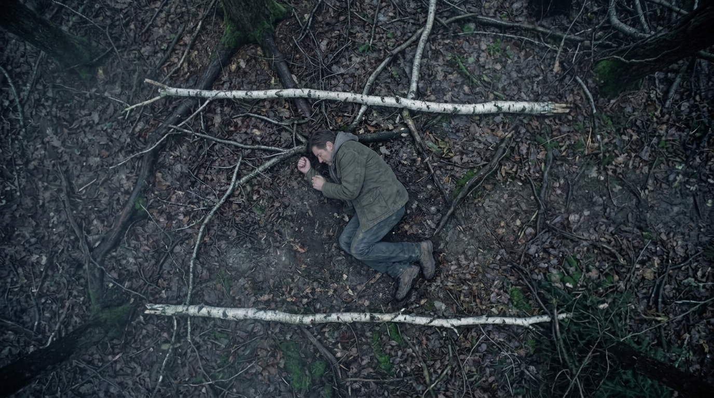

**Scene:** The last beat of the **SEE** movement (10–15) — the come-down after
the vision. Directly overhead, top-down: Tarquin asleep curled on the dark wet
forest floor of the Welsh retreat, small in the frame, cold dawn mist. Two pale
fallen birch branches run parallel either side of him, faintly rhyming with the
white lines of a parking bay — the two-spaces device turned back on him while he
is unconscious. It must read first as forest and only second as a parking bay;
the man must read as retreat Tarquin (olive field jacket over grey marl, per
`i12`/`i24`). Holds 1.8 and cuts hard into slide 16 — waking is a hard cut, no
transition.

**Prompt (planned, for the image lane):**
> Cinematic film still, 35mm, cold dawn mist. Directly overhead top-down shot:
> a man in an olive field jacket asleep on his side on dark wet forest floor,
> curled small among roots and dead leaves, arms tucked in. Two pale fallen
> birch branches lie on the ground running parallel, one either side of him,
> faintly suggesting the white lines of a parking bay. Muted palette, the
> man small in the frame, quiet and still.

Acceptance: reads first as forest, the bay-lines rhyme only on a second look.

Reference images (§4, T-IMG-3 — generate via `flow_generate_image` + refs):
- `img/i25.png` — Tarquin asleep on forest floor (closest existing)
- `img/i24.png` — jacket

**Bubbles:** none

**Page:** hold 1.8 · `transition=null` into slide 16 (wake = hard cut) · no effect.

**Revisions:**
- v0 (2026-07-25) — recut spec
- v1 (2026-07-25) — generated (2 candidates, ref i25); accepted candidate b: birch branches run cleanly parallel either side, bay rhyme lands on second look. Candidate a rejected: branches crossed and chaotic, rhyme illegible.
