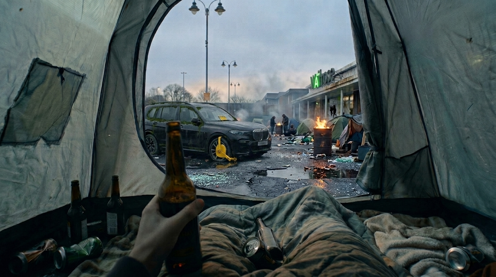

**Scene:** Opening beat of the **BECOME** movement (16–25) and the hard cut out
of slide 15's overhead sleep — no transition, the wake is a jolt. POV from
inside the tent looking out through the door flap, the same framing that
bookended the trip at slide 8, so the audience recognises the geometry before
Tarquin does. What must read on screen: the camp beyond the doorway is burning;
the black BMW X7 sits derelict and wheel-clamped in exactly the spot it occupied
in slide 8; and the Waitrose fascia has died down to just two lit letters — **A**
and **I**. Hold 2.2.

**Prompt (planned, for the image lane):** edit of a golden — T-IMG-4.

Base golden for this edit:
`https://storage.googleapis.com/badcode-storage/comics-v2/camping-jack-test/img/i16.png`

> Same image, same composition, same weather. Two changes only. (1) On the
> Waitrose fascia sign in the background, every letterform is dead and dark
> except the letters "A" and "I", which still glow supermarket-green. (2) In
> the car park visible through the tent doorway, where a parking bay shows,
> add a derelict black BMW X7 — flat tyres, moss along the window seals, a
> yellow wheel clamp on the front wheel, a faded yellow-and-black penalty
> notice under the wiper, number plate T4RQ 1N. Keep every other element
> identical to the reference.

Acceptance: A+I lighting reads at low-res; the X7 sits where it stood in `i05`;
no drift elsewhere in the frame.

Reference images (§4 WAVE-2, T-IMG-4):
- golden: `img/i16.png`
- X7 ref: `img/i05.png`

**Bubbles:**
- T "…Wales. I was in Wales." — x 25.00 · y 20.00 · type T · tail none ·
  appearAt [0.5, 1] · **TUNE** (§5 NEW)

**Page:** hold 2.2 · transition: default (slide 15 sets `transition=null` into
this page — the wake is a hard cut) · effect: none.

**Revisions:**
- v0 (2026-07-25) — recut spec
- v1 (2026-07-25) — edit of golden i16 (2 candidates); accepted candidate a: only A and I lit on the fascia, mossy clamped X7 with penalty notice in the slide-8 spot. Candidate b rejected: most of the Waitrose sign still lit, no penalty notice.
