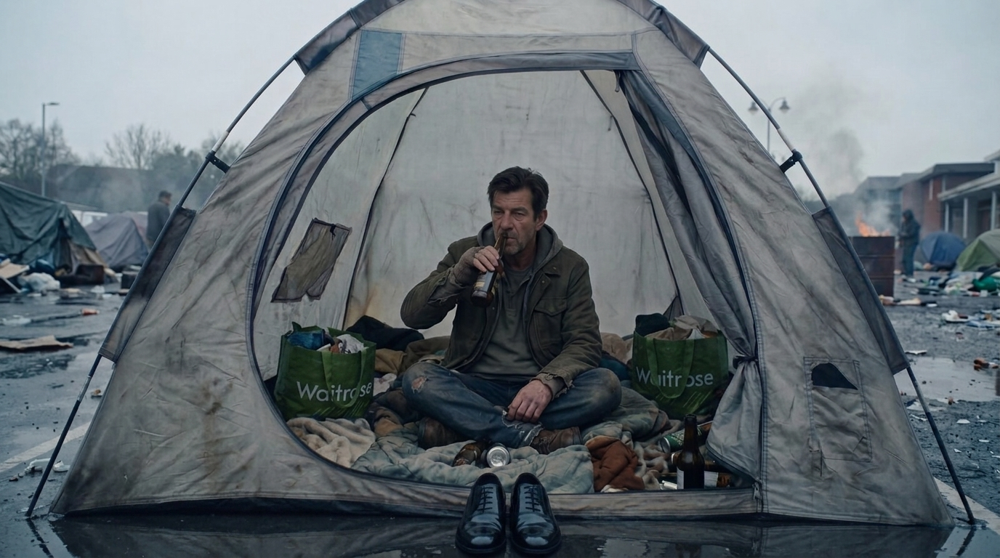

**Scene:** BECOME (16–25), the closing rhyme. Tarquin sits cross-legged in the
mouth of a battered tent drinking, framed exactly as Bob was in slide 9 — same
frontal composition, same wet car park behind him. Two additions carry the whole
beat: a pair of polished black Oxford shoes placed neatly side by side on the
tarmac outside the flap, and green Waitrose "Bag for Life" totes serving as his
luggage among the bedding. No bubbles — the composition is the line, so the
shoes and the wordmark must read cleanly at scroll speed.

**Prompt (planned, for the image lane):**
> Same image, same composition, same palette. Two additions only. (1) On the
> wet tarmac just outside the tent flap, bottom of frame, a pair of polished
> black Oxford shoes placed neatly side by side, toes aligned. (2) Among the
> bedding inside the tent, two green Waitrose "Bag for Life" tote bags used as
> luggage, wordmark legible. Keep the man, tent and background identical.

Acceptance: shoes read as deliberate ritual, not debris; bags legible at 720p.

Base golden for this edit (T-IMG-5, `i38` = edit of `i31`):
https://storage.googleapis.com/badcode-storage/comics-v2/camping-jack-test/img/i31.png

References (§4 WAVE-2 table):
- golden: `img/i31.png`
- rhyme ref: `img/i07.png`

**Bubbles:** none — the composition is the line.

**Page:** hold 2.6 · transition: default · effect: none

**Revisions:**
- v0 (2026-07-25) — recut spec
- v1 (2026-07-25) — edit of golden i31 (2 candidates); accepted candidate a: Oxfords centred and paired at the flap, both Waitrose Bag for Life totes legible, framing rhymes with i07. Candidate b rejected: shoes off to one side, bags bunched left.
