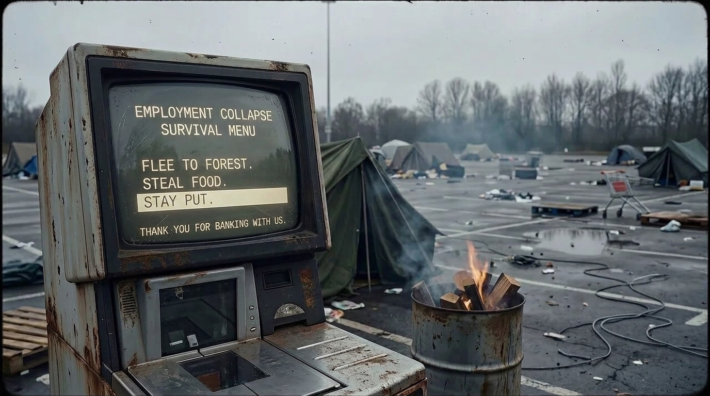

**Scene:** The stinger, closing the BECOME movement (16–25) and the comic. A
rusted CRT survival-menu machine stands in the rain-soaked car park, its
phosphor screen the only light source in the frame — the same machine as the
`a12` poster frame, held as a still card rather than a video. The menu reads
`EMPLOYMENT COLLAPSE SURVIVAL MENU` with the pale highlight bar now resting on
`▸ STAY PUT`, and a smaller footer line beneath the options: `THANK YOU FOR
BANKING WITH US.` What must read on screen: the menu header, the selected
STAY PUT row, and the footer joke — in that order of legibility, at 720p.

**Prompt (planned, for the image lane) — T-IMG-6 · `i39`:**
> Same image: the rusted CRT survival-menu machine in the car park. Changes:
> the pale highlight bar moves from "FLEE TO FOREST." to "STAY PUT." so STAY
> PUT is the selected option; beneath the menu list, add one smaller line of
> the same phosphor CRT type: "THANK YOU FOR BANKING WITH US." Keep the
> screen's scratches, grime and glow identical.

Acceptance: menu still reads EMPLOYMENT COLLAPSE SURVIVAL MENU; footer is
smaller than the options; nothing else moves.

Kind: **edit of a golden** (`flow_edit_image`, reference-anchored).
Base golden / reference image: `derived/anim/a12.poster.webp` — fetch the
full-res poster from
https://storage.googleapis.com/badcode-storage/comics-v2/camping-jack-test/derived/anim/a12.poster.webp

**Bubbles:** none

**Page:** hold 2.4 · transition `fadeOutFadeIn` (in) · effect none

**Revisions:**
- v0 (2026-07-25) — recut spec
- v1 (2026-07-25) — edit of golden a12 poster (2 candidates); accepted candidate a: STAY PUT highlighted, all three options legible, footer "THANK YOU FOR BANKING WITH US." Candidate b rejected: FLEE TO FOREST half-erased.
