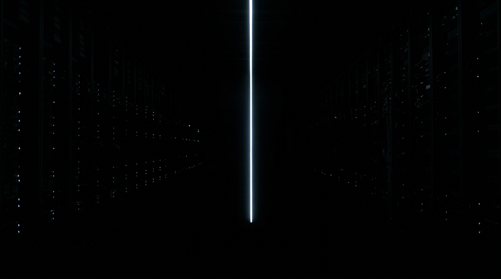

**The BadCode register anchor** — the calibration reference the `new-image`
skill reads before generating any brand image. Near-black server hall, one thin
blade of light, LED constellations.

Provenance: this was panel 1 of the GPOM Short comic (`docs/stories/gpom-short/`
— story folder deleted 2026-08-06; the comic itself is still live at
`/comics/gpom-short`, and the full panel records live on in git history).
Relocated here because the anchor is brand infrastructure, not story canon.

**Scene (as authored for the comic):** Cold open. Monumental dark server hall,
one thin vertical line of cool light — the backdrop for the species' commit log
(fire · the wheel · writing · money · the engine · the bomb · the network · the
model), which was a code overlay drawn descending along the line.

**Prompt (exact, sent to Flow):**
> Hyper-realistic photograph, shot on 35mm film with fine natural grain, muted
> cool-neutral palette, no lens flares, calm observational tone, landscape
> orientation. A monumental dark server hall lost in blackness, photographed
> from a distance: one thin vertical line of cool pale light running from the
> top of the frame to the bottom, the only illumination, with faint
> out-of-focus points of light hanging in the darkness either side of it like
> distant status LEDs. Machine-precise geometry receding into deep clean black.
> No people, no text, no fantasy effects.

**Revisions:**
- v1 (2026-07-02) — initial; accepted first take (as gpom-short p01).
- 2026-08-06 — relocated to `docs/images/` when the gpom-short story folder
  was deleted.
